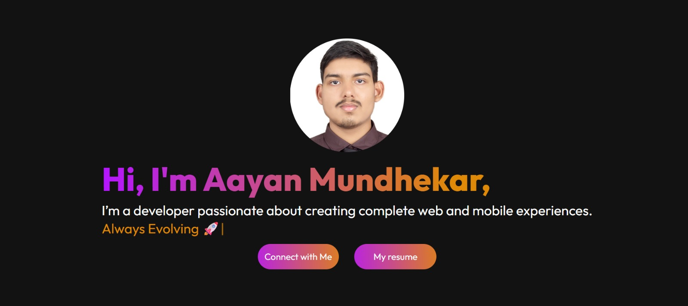
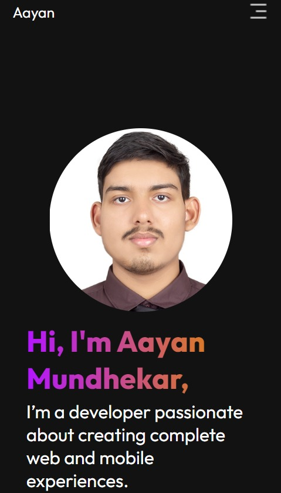
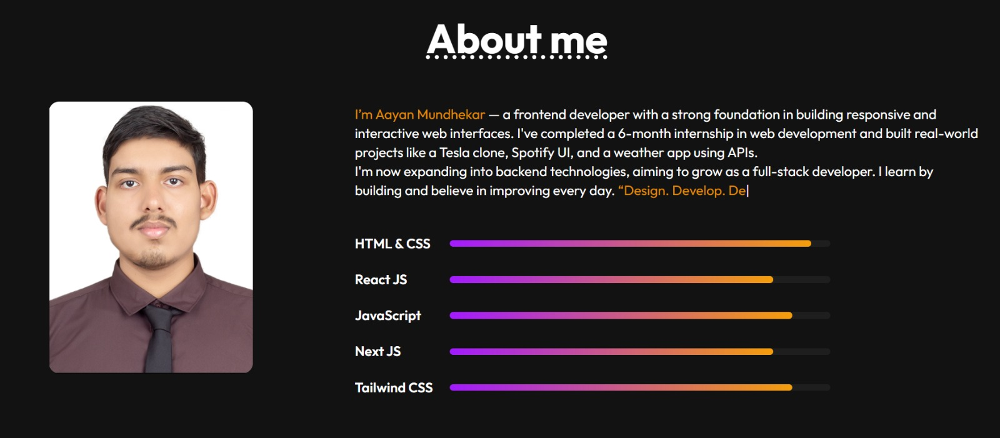

# 🌐 Personal Portfolio – Aayan Mundhekar

Welcome to my personal portfolio website! This project showcases my skills, experience, and projects as a developer. It's built with HTML, CSS, and JavaScript and fully responsive for both desktop and mobile devices.

---

## 📸 Preview

| Desktop View | Mobile View |
|--------------|-------------|
|  |  |


---

## 🚀 Live Demo

🔗 [Click here to view my portfolio live](https://aayanportfolio.vercel.app/)  


---

## 🛠️ Tech Stack

- HTML5
- CSS3 (with Flexbox & Media Queries)
- JavaScript (DOM manipulation)
- Typed.js for animated text

---

## 📱 Responsive Design

- ✅ Mobile-first approach
- ✅ Hamburger menu for mobile
- ✅ Clean UI with modern layout
- ✅ CSS hover effects and animations

---

## ✨ Features

- Animated landing section with Typed.js
- About Me, Skills, Services, and Contact sections
- Mobile menu with icon toggle
- Highlighted skill progress bars
- Smooth scroll behavior
- Dark theme color palette


---

## 📸 Screenshots

| Desktop View                          | Mobile View                            |
|---------------------------------------|----------------------------------------|
|    |       |

---

## 🛠️ Tech Stack

- **HTML5**
- **CSS3**
- **Vanilla JavaScript**
- **Typed.js** for typewriter animation

---

## 📬 Contact

If you'd like to connect or collaborate, feel free to reach out:

- 📧 Email: mundhekaraayan@gmail.com
- 🌐 Portfolio: (https://aayanportfolio.vercel.app/)

- 💻 GitHub: (https://github.com/devaayan)

---

## 📌 How to Use

1. Clone the repository:

   ```bash
   git clone https://github.com/devaayan/portfolio.git


